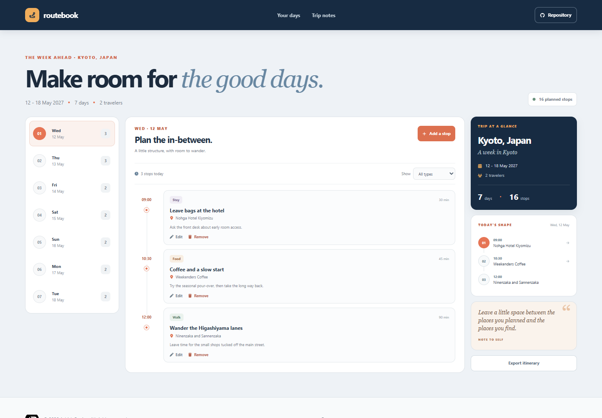

# Routebook - Trip Itinerary Builder

Routebook helps organize a trip one day at a time. Choose a day, add places in the order you plan to visit them, and keep practical notes beside each stop.

**Live app:** [https://a2rp.github.io/trip-itinerary-builder/](https://a2rp.github.io/trip-itinerary-builder/)

## What's included

- A seven-day sample trip to Kyoto with a date, traveler count, and starter stops.
- A day selector with stop counts. Use the mouse or keyboard to switch days. The vertical selector uses Up and Down; the compact mobile selector also accepts Left and Right. Home and End go to the first and last day.
- A time-sorted schedule for the selected day. Each stop shows its start time, activity, place, type, planned length, and optional note.
- A type filter for food, walks, sightseeing, culture, stays, and transit. If a type has no stops that day, choose **Show all types** or add an activity.
- An **Add a stop** form for the activity, place, start time, length, type, and a note. Stops are sorted by time after they are saved.
- Edit controls on every stop. Remove opens a confirmation dialog; cancel, Escape, or closing the dialog keeps the stop. The dialog supports keyboard focus and starts with the safe action focused.
- A trip summary with the total days, travelers, stop count, and a short view of the selected day's route. The counts update when stops are added or removed.
- An **Export itinerary** action that downloads all days and stops as `routebook-kyoto-itinerary.json`.
- A responsive layout for desktop and mobile.

## Saving and limits

The itinerary is saved in this browser's local storage on this device. It is not uploaded, shared, or synced to an account. Clearing this site's browser data removes your changes and brings back the sample Kyoto trip. Export a JSON copy if you want a backup.

The sample trip's destination, dates, traveler count, and seven-day structure are preset. You can add, edit, filter, and remove its stops. This app does not look up maps, opening hours, bookings, or transit times, and its route summary is a simple list rather than turn-by-turn directions.

## Run locally

Use Node.js and npm, then start the development server:

```sh
npm install
npm run dev
```

Run the linter and create a production build with:

```sh
npm run lint
npm run build
npm run preview
```

Publish the built `dist` folder to GitHub Pages with:

```sh
npm run deploy
```

The deploy script builds the app and publishes `dist` to the `gh-pages` branch, including the `.nojekyll` marker used by GitHub Pages.

## Future improvements

These are ideas and are not implemented:

- Let people edit the destination, trip dates, traveler count, and number of days.
- Create and switch between multiple trips.
- Add map links, opening hours, bookings, and transit estimates for saved places.
- Export to calendar formats or import a previously exported JSON itinerary.
- Sync plans across devices with an account.

## Links

- Portfolio: [https://www.ashishranjan.net](https://www.ashishranjan.net)
- GitHub: [https://github.com/a2rp](https://github.com/a2rp)
- CodePen: [https://codepen.io/ash1198](https://codepen.io/ash1198)
- LinkedIn: [https://www.linkedin.com/in/aashishranjan](https://www.linkedin.com/in/aashishranjan)
- Facebook: [https://www.facebook.com/theash.ashish/](https://www.facebook.com/theash.ashish/)
- YouTube: [https://www.youtube.com/@ashishranjan-ashz?sub_confirmation=1](https://www.youtube.com/@ashishranjan-ashz?sub_confirmation=1)
- Email: [mailto:ash.ranjan09@gmail.com](mailto:ash.ranjan09@gmail.com)

## Support

- Support: [https://a2rp-donation-page.netlify.app/](https://a2rp-donation-page.netlify.app/)
- Buy Me a Coffee: [https://buymeacoffee.com/ashishranjan](https://buymeacoffee.com/ashishranjan)
- Patreon: [https://www.patreon.com/ashishranjan](https://www.patreon.com/ashishranjan)
